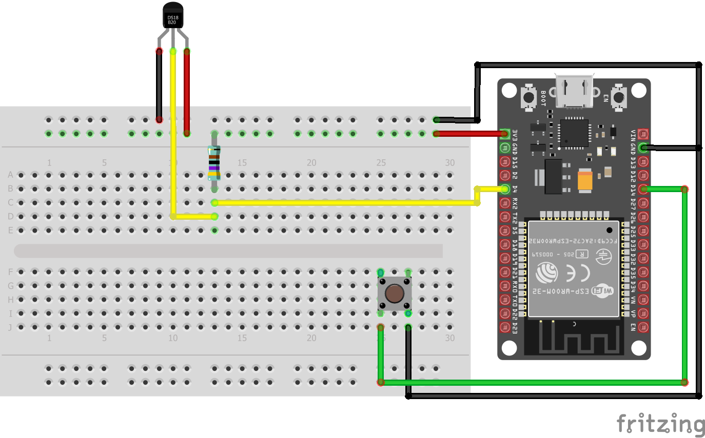
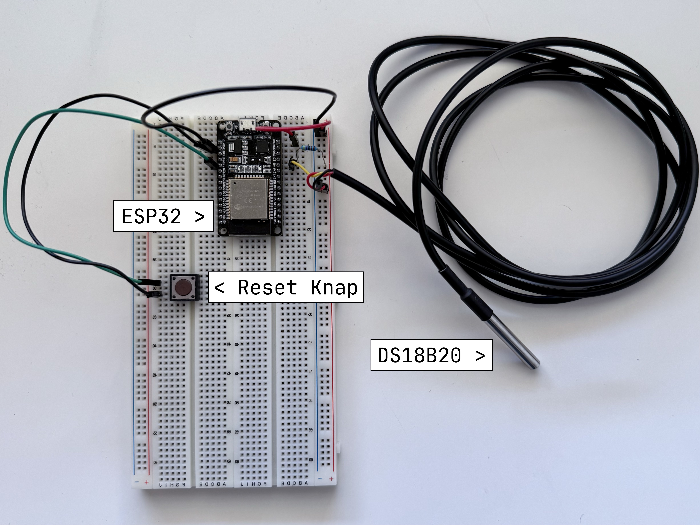

# Temperaturmåler
## Indholdsfortegnelse
1. [Beskrivelse](#beskrivelse)
2. [Filoversigt](#filoversigt)
3. [Brugervejledning](#brugervejledning)
    1. [Setup](#setup)
    2. [Brug](#brug)
4. [Dokumentation/Demo](#dokumentationdemo)
    1. [Fritzing diagram](#fritzing-diagram)
    2. [Fysisk setup](#fysisk-setup)
    3. [Web UI demo](#web-ui-demo)

## Beskrivelse
Dette projekt er en temperaturmåler, som måler temperaturen og viser den på en hjemmeside (som også kører på ESP32). Den er bygget med en ESP32 og en DS18B20 temperatursensor. Den måler temperaturen hvert 5. minut og viser den på en hjemmeside. Hjemmesiden opdateres automatisk.

## Filoversigt
```plaintext
/
├── src
│   ├── main.cpp                 # Entry point for programmet
│   ├── preferences_handler.h    # Utility fil til at samle funktioner til at gemme og hente preferences
│   ├── storage_handler.h        # Utility fil til at samle funktioner til at gemme og hente data fra SPIFFS
│   ├── webserver_setup.h        # Utility fil til at samle funktioner til at opsætte webserveren
│   └── websocket_handler.h      # Utility fil til at samle funktioner til at håndtere websockets
├── data
│   ├── ap_root.html             # Root html filen til AP mode
│   ├── ap_script.js             # Javascript fil til AP mode
│   ├── sta_root.html            # Root html filen til standard mode
│   └── sta_script.js            # Javascript fil til standard mode
└── README.md                    # Denne fil
```

## Brugervejledning

### Setup
* Hold reset-knappen nede, indtil den indbyggede LED blinker.
* Forbind derefter til access pointet `ESP32-Felix` med password `password`.
* Åbn en browser og gå til `192.168.4.1`.
* Indtast dit eget netværks SSID og password.
* Tryk på `Save` og vent på, at enheden genstarter.

### Brug
* Efter enheden er forbundet til dit eget netværk, kan du finde IP-adressen i seriel monitor eller på din router.
* Gå til IP-adressen i en browser.
* Her kan du se en graf over temperaturen.
* Du kan også se den nuværende temperatur.

## Dokumentation/Demo

### Fritzing diagram


### Fysisk setup


### Web UI demo
Klik på billedet for at se en demovideo.

[](https://www.youtube.com/watch?v=LTltwZoyWiU)